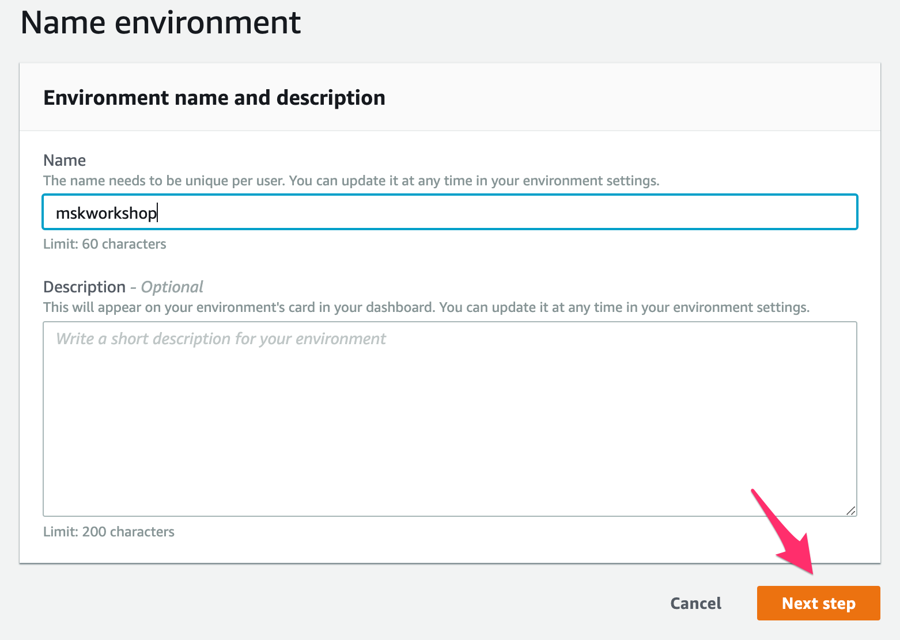
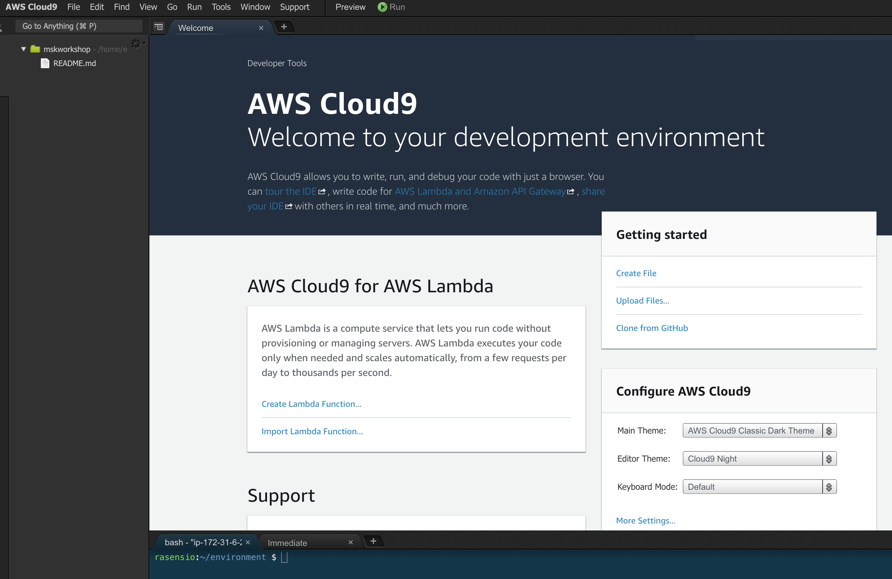

# Setup your IDE

> [!DANGER]
> Ad blockers, javascript disablers, and tracking blockers should be disabled for the cloud9 domain, or connecting to the workspace might be impacted. Cloud9 requires third-party-cookies. You can whitelist the specific domains.

## 1. Create your Cloud9 environment

Choose the region 

<!-- tabs:start -->
#### ** Virginia USA**
Create a Cloud9 Environment using the console https://eu-west-1.console.aws.amazon.com/cloud9/home?region=us-east-1
#### ** Ireland **
Create a Cloud9 Environment using the console https://eu-west-1.console.aws.amazon.com/cloud9/home?region=eu-west-1
<!-- tabs:end -->

* Select **Create environment**
* Name it **mskworkshop**, and take all other defaults
* When it comes up, customize the environment by closing the welcome tab and lower work area, and opening a new terminal tab in the main work area:



And finally you have your IDE all setup.




## 2. Install command line tools

You will now use the terminal located in the bottom of the Cloud9 Environment. Install JQ and envsubst

```bash
sudo yum -y install jq gettext
```

## 2. Set the default region

AWS has many regions around the world and you will work on one of them. Execute the following script to set default variables in your Cloud9 IDE with the current region.

```bash
export ACCOUNT_ID=$(aws sts get-caller-identity --output text --query Account)
export AWS_REGION=$(curl -s 169.254.169.254/latest/dynamic/instance-identity/document | jq -r '.region')

echo "export ACCOUNT_ID=${ACCOUNT_ID}" >> ~/.bash_profile
echo "export AWS_REGION=${AWS_REGION}" >> ~/.bash_profile
aws configure set default.region ${AWS_REGION}
aws configure get default.region
```