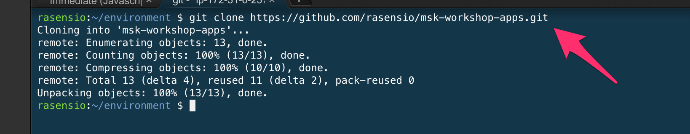
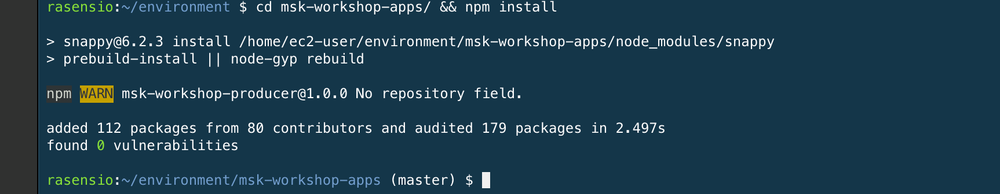

# Donwload the Apps

> [!TIP]
> In the [Create IDE step](1-getting-started/setup-ide) You created a new Cloud9 environment that is going to be our terminal where we will run the different applications needed for the workshop. [Get to the Cloud9 environment](https://eu-west-1.console.aws.amazon.com/cloud9/home?region=eu-west-1) and select your recently created environment **mskworkshop**

Copy the following code and paste it in the terminal.

## 1. Clone apps

```bash
cd ~/environment
git clone https://github.com/rasensio/msk-workshop-apps.git
```



## 2. Install dependencies

Now get into the folder just downloaded and install the NodeJS dependencies. This is the set of scripts that will help us to produce and consume messages

```bash
cd ~/environment/msk-workshop-apps/ && npm install
```

You now should see the success of this operation


