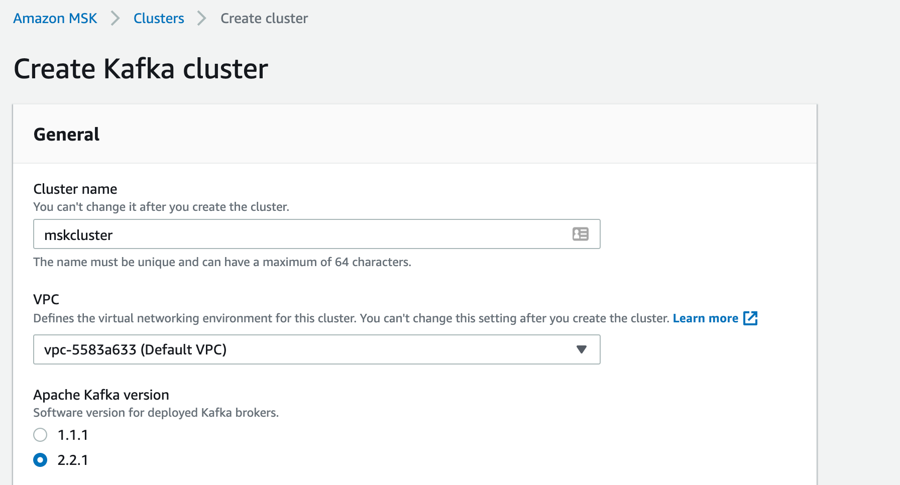
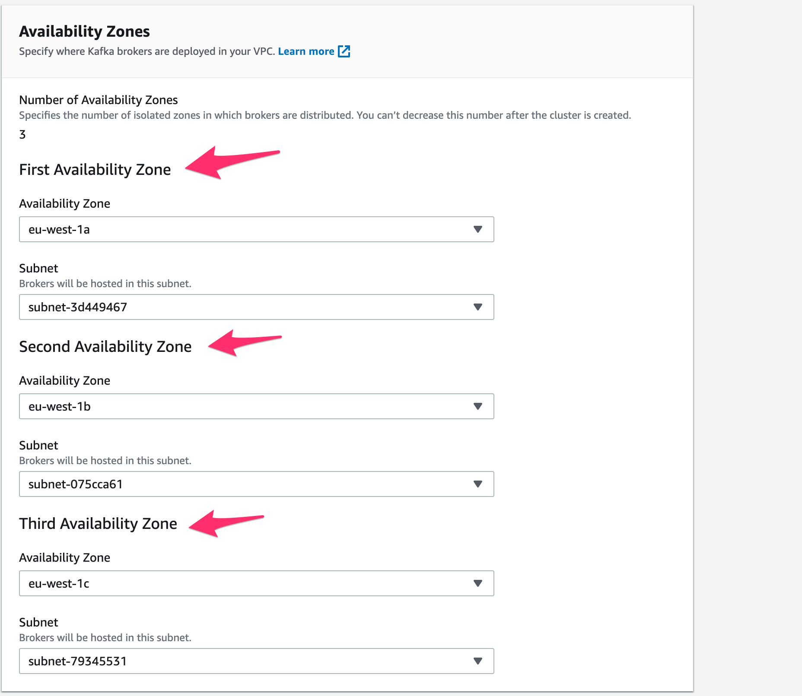
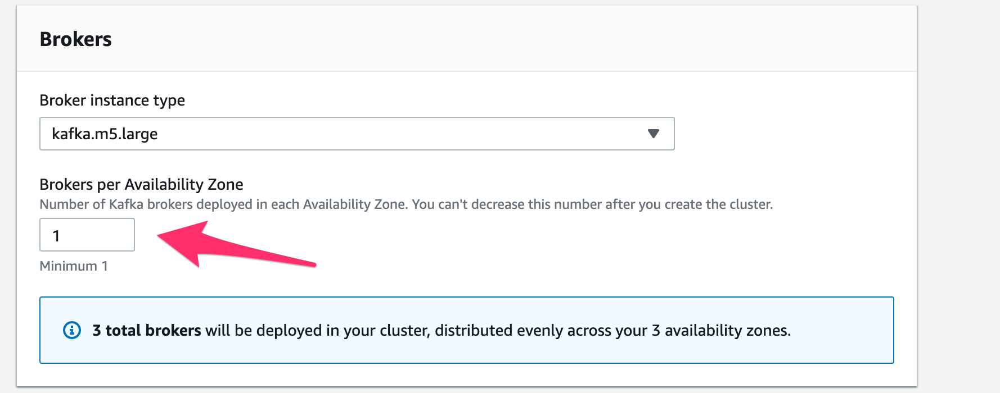
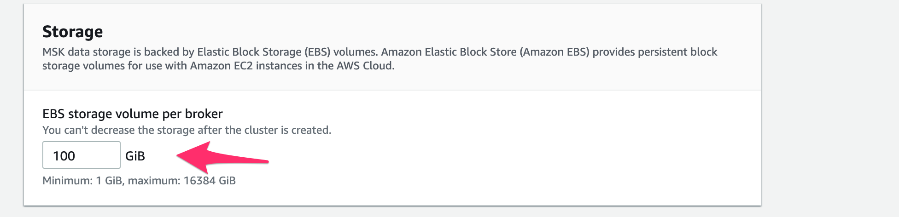
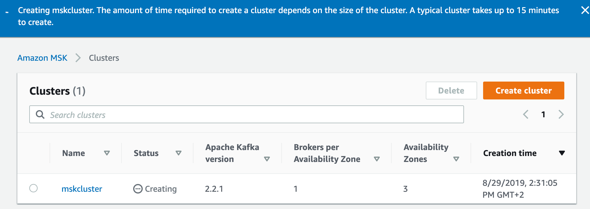

# Launch MSK cluster

Get to the MSK console [here](https://eu-west-1.console.aws.amazon.com/msk/home?region=eu-west-1#/home)

There are many options to fill. Let's start by the name
* Give it a name <code>mskcluster</code> and select the version 2.2.x

By default, all the availability zones will be selected. Just keep going.

Select the M5 Large server and only 1 broker per Availability Zone

Set the store per broker to be 100 GiB

Now press <code>Create Cluster</code>

> [!TIP]
> Now go grab a :coffee: since a typical cluster takes up to 15 minutes to create.

