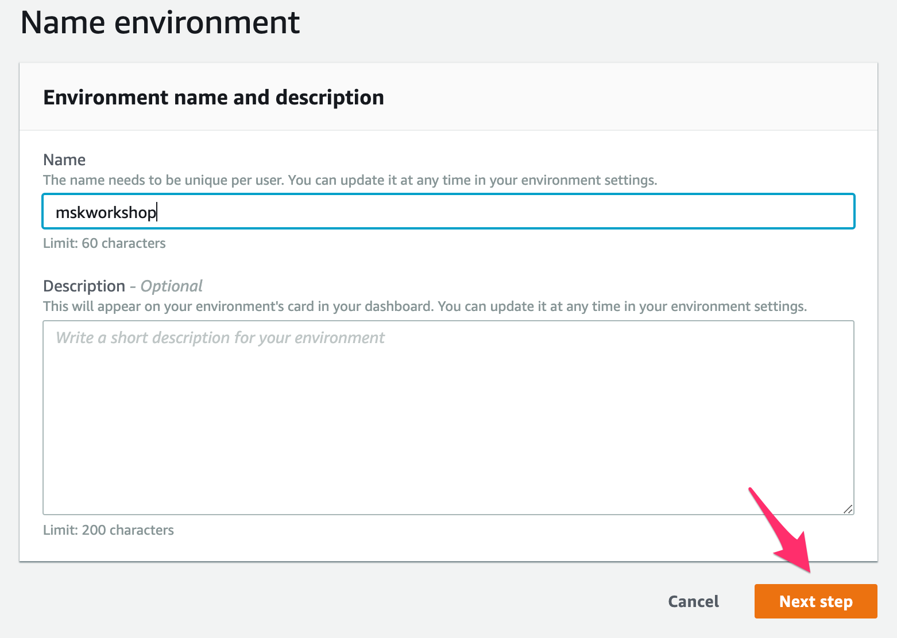
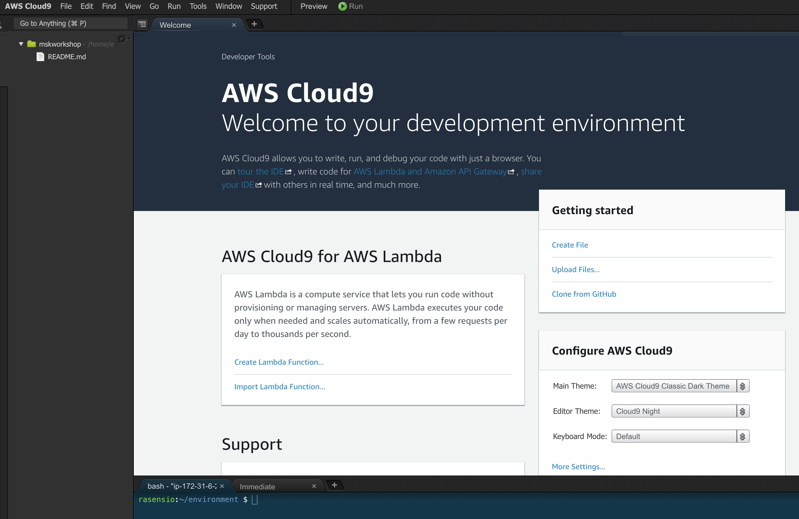

# Setup your IDE

> [!DANGER]
> Ad blockers, javascript disablers, and tracking blockers should be disabled for the cloud9 domain, or connecting to the workspace might be impacted. Cloud9 requires third-party-cookies. You can whitelist the specific domains.

## Create your Cloud9 environment

Create a Cloud9 Environment [using the console](https://eu-west-1.console.aws.amazon.com/cloud9/home?region=eu-west-1)

* Select Create environment
* Name it eksworkshop, and take all other defaults
* When it comes up, customize the environment by closing the welcome tab and lower work area, and opening a new terminal tab in the main work area:

And finally you have your IDE all setup.

