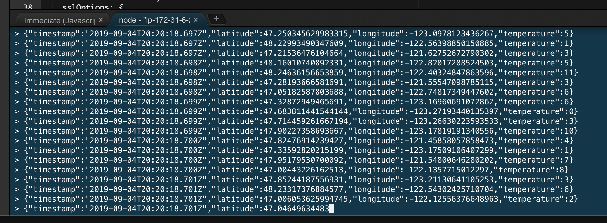

# Exersice #1 - Producing and Consuming Messages

> [!TIP]
> You will run a producer and a consumer in your MSK Cluster and dump the messages in the console of Cloud9

## 1. Start the Consumer

Open a new terminal window and copy and execute the following script. It will start consuming the messages from Kafka published by the producer in the other tab. 

```shell
cd ~/environment/msk-workshop-apps/
node consumer $CLUSTER metrics
```
You should start seeing messages being printed in the console like this. 

