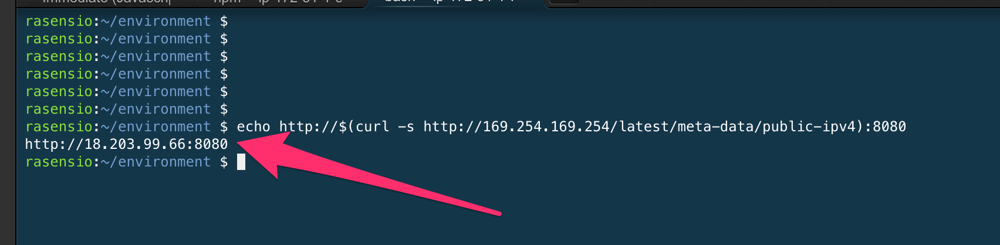

# Exersice #2 - Nuclear Plant Dashboard

## 1. Open your IDE HTTP port

You will use the AWS CLI to add a new ingress rule to your Cloud9 security group.

```bash
aws ec2 authorize-security-group-ingress \
    --group-id $IDE_SEC_GROUP \
    --protocol tcp \
    --port 8080 \
    --cidr 0.0.0.0/0
```

Now install the dependencies and start serving the UI

```bash
cd ~/environment/msk-workshop-apps/ui
npm install
```

And finally start the UI

```bash
cd ~/environment/msk-workshop-apps/ui
npm run serve
```

To preview the application you must invoke the IP and port of the Cloud9 environment. To get the IP address execute this command and open the url displayed.

```bash
echo http://$(curl -s http://169.254.169.254/latest/meta-data/public-ipv4):8080
```

