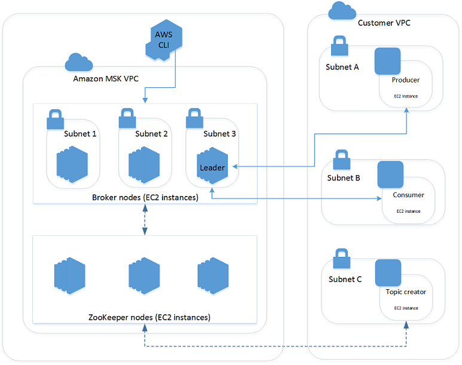

# MSK Workshop

Amazon Managed Streaming for Apache Kafka (Amazon MSK) is a fully managed service that enables you to build and run applications that use Apache Kafka to process streaming data. Amazon MSK provides the control-plane operations and lets you use Apache Kafka data-plane operations, such as those for producing and consuming data. It runs open-source versions of Apache Kafka. This means existing applications, tooling, and plugins from partners and the Apache Kafka community are supported without requiring changes to application code. You can use Amazon MSK to create clusters that use Apache Kafka versions 1.1.1 and 2.2.1.

The following diagram provides an overview of how Amazon MSK works.

